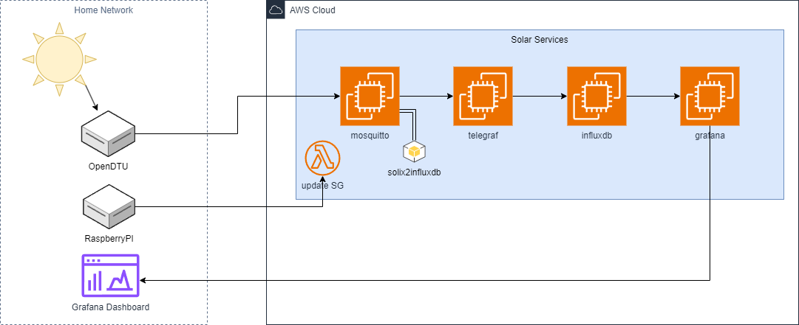

# solarmonitor

Services to monitor my solar system

After receiving my solar system, my target is to monitor my solar system (and in future other components). Instead of having a server at my network at home, I trust in AWS. Therefore I want to use AWS resources, I can use in general to be most flexible.

## Components

The following is the list of my components, I decided to use

* Raspberry Pi
* OpenDTU (replacement of Hoymiles DTU)
* Hoymiles inverter
* Anker Solix Battery
* 4 solar panels

## The challenges

How can I connect my local components to AWS without VPN and how can I secure it. The other challenge is being most flexible, so that my services can handle more and more resources in a cost effective way.

### Updating the security group in AWS

To protect resources in AWS, you can use Security Groups. Using the management console, you can select your current IP address, so that only your network can access them. To do this, I am using the Raspberry PI. Every minute it should be checked, if my current local IP has been changed. If yes, update the Security Group.

### Resources

I want to split all services into separate instances. That means, every services has its own resources, I can increase/decrease them and also having a kind of high availability. EC2 is the way to go for this project.

### Retrieving messages

OpenDTU supports MQTT. Instead of using AWS IoT, I decided to use the most recommended solution and provide a MQTT broker aka mosquitto. Simple in the setup, needs less resources and well documented.

### Storing the messages

In combination of telegraf, influxdb was the choice. To be honest, at the first time, I installed both on one instance, but now also telegraf has its own instance. So I am independent if something will break at one component.

### Dashboard

Only Grafana was in the evaluation, because there are good shared Dashboards, I am able to use, extend.

## The solution

In this graph, I want to show you, how it looks like.



### Detailed overview

| Task/Service | Location | Instance | Notes |
| -------          | -------- | -------- | ----- |
| Update public IP | local | Raspberry PI | Check every minute my public IP |
| OpenDTU          | local | Appliance    | connected to Hoymiles inverter |
| MQTT             | AWS   | t4g.nano     | retrieves MQTT messages only from local network |
| Telegraf         | AWS   | t3a.nano     | read, process and store to InfluxDB (see later, why t3a) |
| InfluxDB         | AWS   | t4g.micro    | Time series database |
| Grafana          | AWS   | t4g.micro    | Dashboard |

---

# Implementation

Some configuration files I have added to this repository. Feel free to use them. I will add more and more information and update this repository, because I also use it as my backup of my own configuration (except passwords :smile:). Using IPv6 will save you money because you do not need to pay for the IP addresses.

How to setup an EC2 is well documented by AWS. Probably I will provide a terraform script to automate it.

## Raspberry PI

Run the script [solar_update_sg.sh](/raspberrypi/solar_update_sg.sh) using cron every minute (or any other interval). My provided script is using my AVM FritzBox with TR069 enabled.

This script invokes a Lambda. To be most secure, create a IAM user, which is only allowed to invoke this Lambda.

## Lambda

The provided Lambda code ([lambda_function.py](/lambda/lambda_function.py)) you can use to update your security group.
Create an environment variable `SGID` and provide the ID of the security group.

The lambda will revoke first and grant after that the permission for your provided IP addresses.

## MQTT

Create an instance using Ubuntu, choose smallest instance size, like t4g.nano (or t3a, t3,...). Be sure you have added this EC2 instance to your security group.

Run `sudo apt install mosquitto`

Create a config file at `/etc/mosquitto/conf.d/`, e.g. solar.conf and add at least the following content:

```yaml
listener 1883
allow_anonymous true
```

Securing it with credentials, encrpytion, etc. will follow.

Be sure, mosquitto will started automatically and it listens on all interfaces (IPv4 and IPv6).

## InfluxDB

Create an instance using Ubuntu, choose a small instance size, like t4g.micro (or t3a, t3,...). Be sure you have added this EC2 instance to your security group.

Follow the installation instructions [Install InfluxDB](https://docs.influxdata.com/influxdb/v2/install/)

Also proceed the setup of InfluxDB like described at [Setup InfluxDB](https://docs.influxdata.com/influxdb/v2/get-started/setup/?t=Set+up+with+the+CLI).

Be sure, InfluxDB will start automatically.

For telegraf, create a token with access to the bucket within InfluxDB. Note, that you should set up retention period to 0 by creating the bucket, e.g. `hoymiles`.

## Telegraf

Create an instance using Ubuntu, choose smallest instance size, like t3a.nano (t3,...). Be sure you have added this EC2 instance to your security group. Also be sure, to use x86 and not ARM. The provided package of telegraf will fail on ARM architecture at AWS.

Follow the installation instructions [Install Telegraf](https://docs.influxdata.com/telegraf/v1/install/)

After installing, create a configuration file in `/etc/telegraf/telegraf.d`. An example file, you will find in this repository [here](/telegraf/etc/telegraf/telegraf.d/hoymiles.conf).

You have to adjust the domain, add the token, you have created see influxdb. 

Only **after** you have created and started mosquitto and influxdb, telegraf will be able start without any issue!

## Grafana

Create an instance using Ubuntu, choose smallest instance size, like t4g.nano (or t3a, t3,...). Be sure you have added this EC2 instance to your security group.

Install Grafana by following the [Install grafana on Debian or Ubuntu](https://grafana.com/docs/grafana/latest/setup-grafana/installation/debian/) instructions. Change initial password and create a Datasource to InfluxDB.

I provide my [Dashboard](/grafana/openDTU%20[Flux]-1726603045824.json), which is an edit of https://grafana.com/grafana/dashboards/18819-opendtu-flux/.

